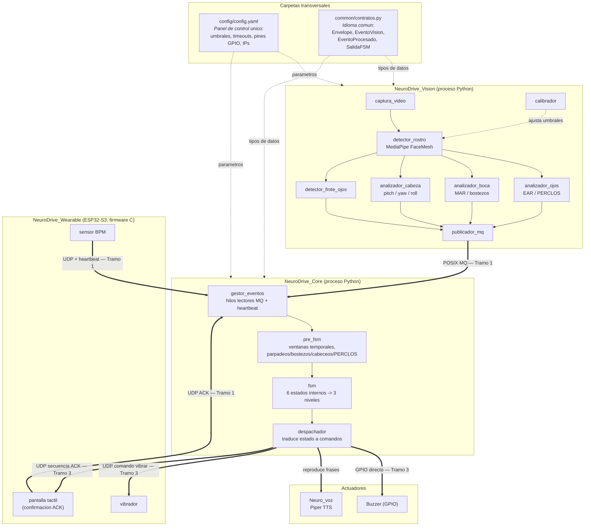
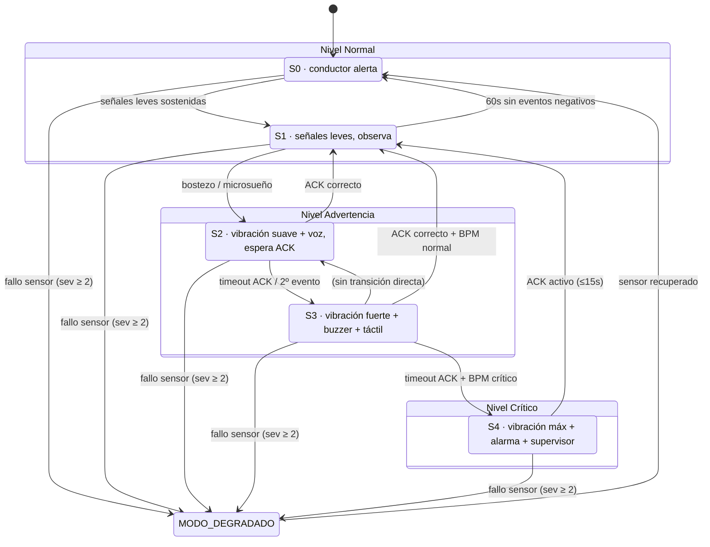

## 1. Diagrama general de NeuroDrive
---

```mermaid
flowchart TB
    %% ===== Carpetas de apoyo =====
    subgraph SOPORTE["Carpetas transversales"]
        YAML["config/config.yaml<br/><i>Panel de control unico:</i><br/>umbrales, timeouts, pines GPIO, IPs"]
        CONTRATOS["common/contratos.py<br/><i>Idioma comun:</i><br/>Envelope, EventoVision,<br/>EventoProcesado, SalidaFSM"]
    end

    %% ===== Proceso Vision =====
    subgraph VISION["NeuroDrive_Vision  (proceso Python)"]
        direction TB
        CAM["captura_video"] --> ROSTRO["detector_rostro<br/>MediaPipe FaceMesh"]
        ROSTRO --> OJOS["analizador_ojos<br/>EAR / PERCLOS"]
        ROSTRO --> BOCA["analizador_boca<br/>MAR / bostezos"]
        ROSTRO --> CABEZA["analizador_cabeza<br/>pitch / yaw / roll"]
        ROSTRO --> FROTE["detector_frote_ojos"]
        CAL["calibrador"] -. ajusta umbrales .-> ROSTRO
        OJOS --> PUB["publicador_mq"]
        BOCA --> PUB
        CABEZA --> PUB
        FROTE --> PUB
    end

    %% ===== Wearable =====
    subgraph WEAR["NeuroDrive_Wearable  (ESP32-S3, firmware C)"]
        direction TB
        BPM["sensor BPM"]
        PANT["pantalla tactil<br/>(confirmacion ACK)"]
        VIBR["vibrador"]
    end

    %% ===== Core =====
    subgraph CORE["NeuroDrive_Core  (proceso Python)"]
        direction TB
        GESTOR["gestor_eventos<br/>hilos lectores MQ + heartbeat"]
        PREFSM["pre_fsm<br/>ventanas temporales,<br/>parpadeos/bostezos/cabeceos/PERCLOS"]
        FSM["fsm<br/>6 estados internos -> 3 niveles"]
        DESP["despachador<br/>traduce estado a comandos"]
        GESTOR --> PREFSM --> FSM --> DESP
    end

    %% ===== Actuadores =====
    subgraph ACT["Actuadores"]
        BUZZER["Buzzer (GPIO)"]
        VOZ["Neuro_voz<br/>Piper TTS"]
    end

    %% ===== Flujos entre procesos =====
    PUB ==>|"POSIX MQ — Tramo 1"| GESTOR
    BPM ==>|"UDP + heartbeat — Tramo 1"| GESTOR
    PANT ==>|"UDP ACK — Tramo 1"| GESTOR
    DESP ==>|"GPIO directo — Tramo 3"| BUZZER
    DESP ==>|"reproduce frases"| VOZ
    DESP ==>|"UDP comando vibrar — Tramo 3"| VIBR
    DESP ==>|"UDP secuencia ACK — Tramo 3"| PANT

    %% ===== Inyeccion de config y contratos =====
    YAML -. parametros .-> VISION
    YAML -. parametros .-> CORE
    CONTRATOS -. tipos de datos .-> VISION
    CONTRATOS -. tipos de datos .-> CORE
```

---

## 2. Diagrama de estados de la FSM

---

```mermaid
stateDiagram-v2
    [*] --> NORMAL

    state "Nivel Normal" as N {
        NORMAL: S0 · conductor alerta
        PRE_ALERTA: S1 · señales leves, observa
        NORMAL --> PRE_ALERTA: señales leves sostenidas
        PRE_ALERTA --> NORMAL: 60s sin eventos negativos
    }

    state "Nivel Advertencia" as A {
        ALERTA_LEVE: S2 · vibración suave + voz, espera ACK
        ALERTA_MEDIA: S3 · vibración fuerte + buzzer + táctil
        ALERTA_LEVE --> ALERTA_MEDIA: timeout ACK / 2º evento
        ALERTA_MEDIA --> ALERTA_LEVE: (sin transición directa)
    }

    state "Nivel Crítico" as C {
        CRITICO: S4 · vibración máx + alarma + supervisor
    }

    PRE_ALERTA --> ALERTA_LEVE: bostezo / microsueño
    ALERTA_LEVE --> PRE_ALERTA: ACK correcto
    ALERTA_MEDIA --> PRE_ALERTA: ACK correcto + BPM normal
    ALERTA_MEDIA --> CRITICO: timeout ACK + BPM crítico
    CRITICO --> PRE_ALERTA: ACK activo (≤15s)

    NORMAL --> MODO_DEGRADADO: fallo sensor (sev ≥ 2)
    PRE_ALERTA --> MODO_DEGRADADO: fallo sensor (sev ≥ 2)
    ALERTA_LEVE --> MODO_DEGRADADO: fallo sensor (sev ≥ 2)
    ALERTA_MEDIA --> MODO_DEGRADADO: fallo sensor (sev ≥ 2)
    CRITICO --> MODO_DEGRADADO: fallo sensor (sev ≥ 2)
    MODO_DEGRADADO --> NORMAL: sensor recuperado
```

