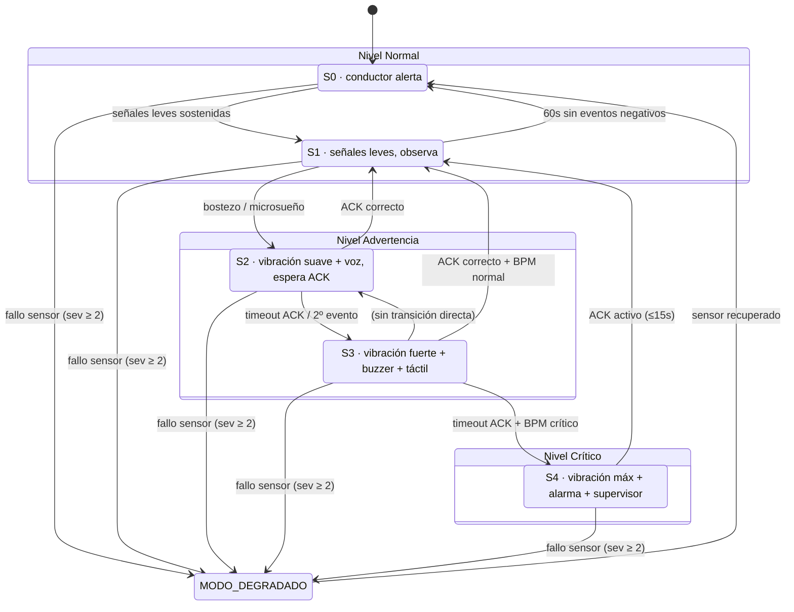
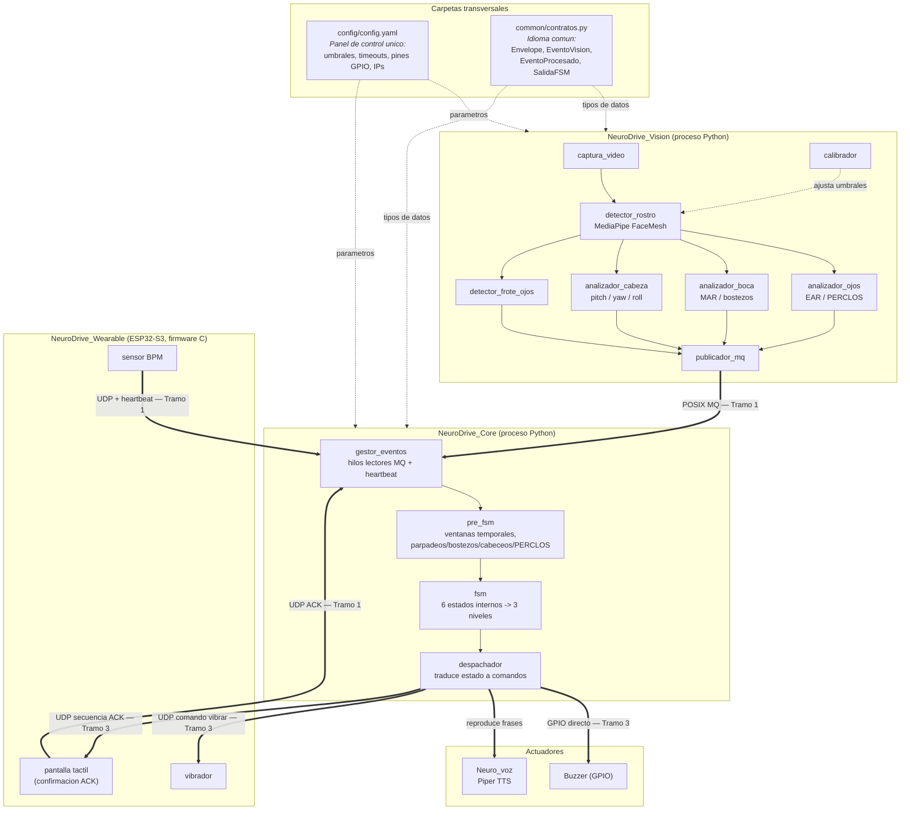
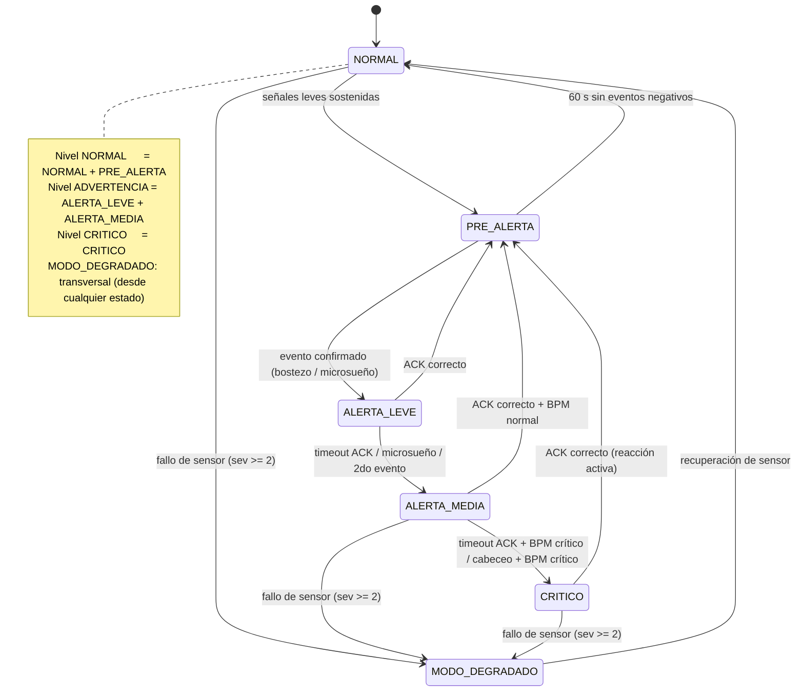

## 1. Diagrama general de NeuroDrive

```mermaid
flowchart TB
    subgraph CAP["Captura — procesos productores"]
        VIS["NeuroDrive_Vision<br/><small>Cámara + MediaPipe (Pi 5)</small>"]
        WEA["NeuroDrive_Wearable<br/><small>ESP32-S3 · BPM + táctil</small>"]
    end

    subgraph IPC["IPC — Tramo 1 (POSIX Message Queues)"]
        MQV(["/neurodrive_vision"])
        MQW(["/neurodrive_wearable"])
    end

    subgraph CORE["NeuroDrive_Core — proceso central (hilos + queue.Queue)"]
        direction LR
        GES["Gestor<br/><small>valida · dedup · heartbeat</small>"]
        PRE["Pre-FSM<br/><small>ventanas · métricas</small>"]
        FSM["FSM<br/><small>decide el nivel</small>"]
        DES["Despachador<br/><small>genera comandos</small>"]
        GES --> PRE --> FSM --> DES
    end

    subgraph ACT["Actuadores — Tramo 3 (UDP + GPIO)"]
        BUZ["Buzzer (GPIO BCM)"]
        VOZ["Neuro_voz (Piper TTS)"]
        WEA2["Wearable (vibrar · ACK)"]
        SUP["Supervisor (notificación)"]
    end

    subgraph BASE["Capa transversal — leída por Visión y Core"]
        CFG["config/config.yaml<br/><small>única fuente de umbrales</small>"]
        CMN["common/contratos.py<br/><small>vocabulario compartido</small>"]
    end

    VIS --> MQV --> GES
    WEA --> MQW --> GES
    DES --> BUZ & VOZ & WEA2 & SUP

    CFG -.lee.-> CAP
    CFG -.lee.-> CORE
    CMN -.importan.-> CAP
    CMN -.importan.-> CORE
```

---

## 2. Diagrama de estados de la FSM

```mermaid
stateDiagram-v2
    [*] --> NORMAL

    state "Nivel Normal" as N {
        NORMAL: S0 · conductor alerta
        PRE_ALERTA: S1 · señales leves, observa
        NORMAL --> PRE_ALERTA: señales leves sostenidas
        PRE_ALERTA --> NORMAL: 60s sin eventos negativos
    }

    state "Nivel Advertencia" as A {
        ALERTA_LEVE: S2 · vibración suave + voz, espera ACK
        ALERTA_MEDIA: S3 · vibración fuerte + buzzer + táctil
        ALERTA_LEVE --> ALERTA_MEDIA: timeout ACK / 2º evento
        ALERTA_MEDIA --> ALERTA_LEVE: (sin transición directa)
    }

    state "Nivel Crítico" as C {
        CRITICO: S4 · vibración máx + alarma + supervisor
    }

    PRE_ALERTA --> ALERTA_LEVE: bostezo / microsueño
    ALERTA_LEVE --> PRE_ALERTA: ACK correcto
    ALERTA_MEDIA --> PRE_ALERTA: ACK correcto + BPM normal
    ALERTA_MEDIA --> CRITICO: timeout ACK + BPM crítico
    CRITICO --> PRE_ALERTA: ACK activo (≤15s)

    NORMAL --> MODO_DEGRADADO: fallo sensor (sev ≥ 2)
    PRE_ALERTA --> MODO_DEGRADADO: fallo sensor (sev ≥ 2)
    ALERTA_LEVE --> MODO_DEGRADADO: fallo sensor (sev ≥ 2)
    ALERTA_MEDIA --> MODO_DEGRADADO: fallo sensor (sev ≥ 2)
    CRITICO --> MODO_DEGRADADO: fallo sensor (sev ≥ 2)
    MODO_DEGRADADO --> NORMAL: sensor recuperado
```
---
## 3. Diagrama general de NeuroDrive

```mermaid
flowchart TB
    %% ===== Carpetas de apoyo =====
    subgraph SOPORTE["Carpetas transversales"]
        YAML["config/config.yaml<br/><i>Panel de control unico:</i><br/>umbrales, timeouts, pines GPIO, IPs"]
        CONTRATOS["common/contratos.py<br/><i>Idioma comun:</i><br/>Envelope, EventoVision,<br/>EventoProcesado, SalidaFSM"]
    end

    %% ===== Proceso Vision =====
    subgraph VISION["NeuroDrive_Vision  (proceso Python)"]
        direction TB
        CAM["captura_video"] --> ROSTRO["detector_rostro<br/>MediaPipe FaceMesh"]
        ROSTRO --> OJOS["analizador_ojos<br/>EAR / PERCLOS"]
        ROSTRO --> BOCA["analizador_boca<br/>MAR / bostezos"]
        ROSTRO --> CABEZA["analizador_cabeza<br/>pitch / yaw / roll"]
        ROSTRO --> FROTE["detector_frote_ojos"]
        CAL["calibrador"] -. ajusta umbrales .-> ROSTRO
        OJOS --> PUB["publicador_mq"]
        BOCA --> PUB
        CABEZA --> PUB
        FROTE --> PUB
    end

    %% ===== Wearable =====
    subgraph WEAR["NeuroDrive_Wearable  (ESP32-S3, firmware C)"]
        direction TB
        BPM["sensor BPM"]
        PANT["pantalla tactil<br/>(confirmacion ACK)"]
        VIBR["vibrador"]
    end

    %% ===== Core =====
    subgraph CORE["NeuroDrive_Core  (proceso Python)"]
        direction TB
        GESTOR["gestor_eventos<br/>hilos lectores MQ + heartbeat"]
        PREFSM["pre_fsm<br/>ventanas temporales,<br/>parpadeos/bostezos/cabeceos/PERCLOS"]
        FSM["fsm<br/>6 estados internos -> 3 niveles"]
        DESP["despachador<br/>traduce estado a comandos"]
        GESTOR --> PREFSM --> FSM --> DESP
    end

    %% ===== Actuadores =====
    subgraph ACT["Actuadores"]
        BUZZER["Buzzer (GPIO)"]
        VOZ["Neuro_voz<br/>Piper TTS"]
    end

    %% ===== Flujos entre procesos =====
    PUB ==>|"POSIX MQ — Tramo 1"| GESTOR
    BPM ==>|"UDP + heartbeat — Tramo 1"| GESTOR
    PANT ==>|"UDP ACK — Tramo 1"| GESTOR
    DESP ==>|"GPIO directo — Tramo 3"| BUZZER
    DESP ==>|"reproduce frases"| VOZ
    DESP ==>|"UDP comando vibrar — Tramo 3"| VIBR
    DESP ==>|"UDP secuencia ACK — Tramo 3"| PANT

    %% ===== Inyeccion de config y contratos =====
    YAML -. parametros .-> VISION
    YAML -. parametros .-> CORE
    CONTRATOS -. tipos de datos .-> VISION
    CONTRATOS -. tipos de datos .-> CORE
```

---
## 4. Diagrama de estados de la FSM

```mermaid
stateDiagram-v2
    [*] --> NORMAL

    NORMAL       --> PRE_ALERTA    : señales leves sostenidas
    PRE_ALERTA   --> NORMAL        : 60 s sin eventos negativos
    PRE_ALERTA   --> ALERTA_LEVE   : evento confirmado (bostezo / microsueño)
    ALERTA_LEVE  --> PRE_ALERTA    : ACK correcto
    ALERTA_LEVE  --> ALERTA_MEDIA  : timeout ACK / microsueño / 2do evento
    ALERTA_MEDIA --> PRE_ALERTA    : ACK correcto + BPM normal
    ALERTA_MEDIA --> CRITICO       : timeout ACK + BPM crítico / cabeceo + BPM crítico
    CRITICO      --> PRE_ALERTA    : ACK correcto (reacción activa)

    NORMAL       --> MODO_DEGRADADO : fallo de sensor (sev >= 2)
    ALERTA_MEDIA --> MODO_DEGRADADO : fallo de sensor (sev >= 2)
    CRITICO      --> MODO_DEGRADADO : fallo de sensor (sev >= 2)
    MODO_DEGRADADO --> NORMAL       : recuperación de sensor

    note right of NORMAL
        Nivel NORMAL      = NORMAL + PRE_ALERTA
        Nivel ADVERTENCIA = ALERTA_LEVE + ALERTA_MEDIA
        Nivel CRITICO     = CRITICO
        MODO_DEGRADADO: transversal (desde cualquier estado)
    end note
```
