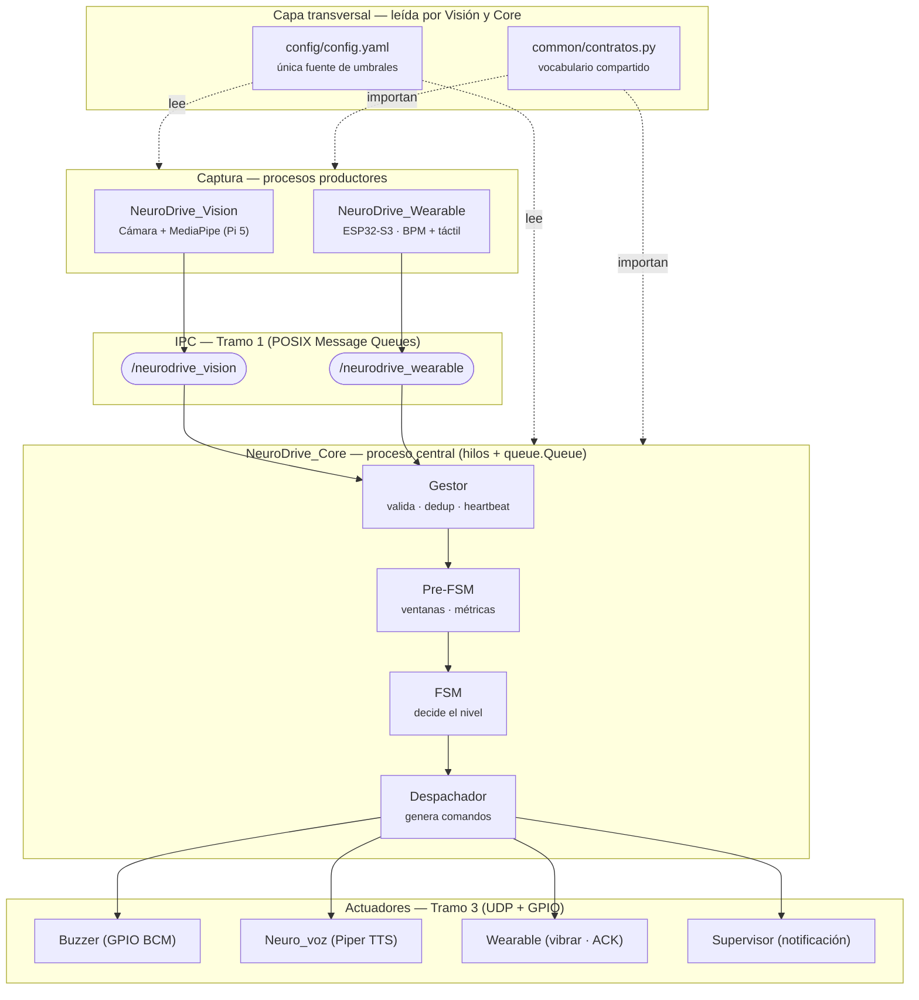
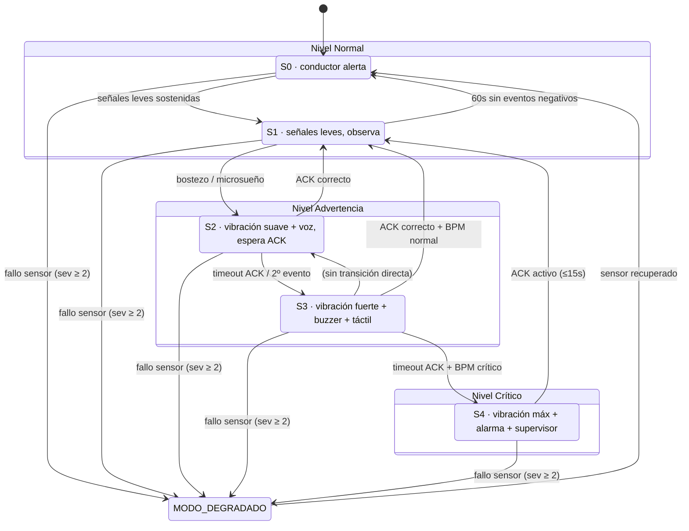

---

## 2. Diagrama de estados de la FSM

---

Con esto tenés la vista general cerrada: el diagrama de bloques con las cuatro capas y los dos cimientos (`config`/`common`), y la FSM completa con el mapeo a los 3 niveles. Ambos los tenés en versión visual (para entender) y en Mermaid (para pegar en tu `.md`).

Cuando vayas analizando módulo por módulo y te surja una duda puntual, decime cuál estás mirando y la vemos en detalle. Un par de cosas que probablemente quieras tener a mano cuando lleguemos al nivel fino: la convención de pitch (cabeza abajo = pitch positivo, ya validada en hardware) y el detalle de que la Visión envía el `pitch_grados` ya normalizado restando el `pitch_neutro` de la calibración.
