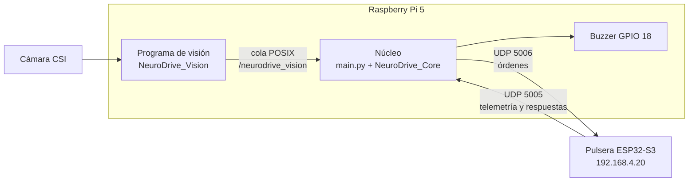
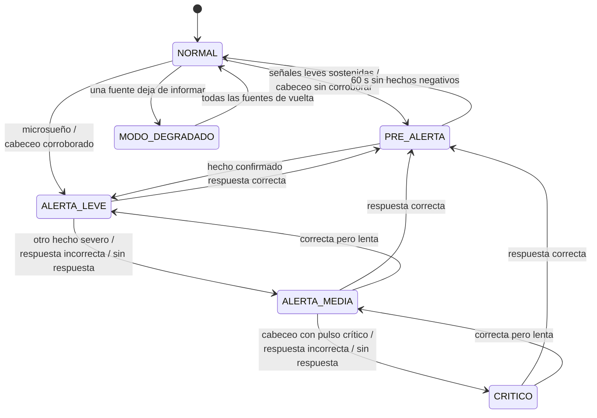

# NeuroDrive

Sistema de detección de somnolencia para conductores de larga distancia.
Trabajo Final Integrador de Técnicas Digitales III, UTN Facultad Regional La Rioja.

Una cámara observa el rostro del conductor y una pulsera mide su pulso. Una
Raspberry Pi 5 combina las dos fuentes, decide un nivel de alerta y actúa: un
buzzer en la cabina y una verificación de atención en la pulsera, que vibra de
una a cuatro veces y espera que el conductor toque el pad correspondiente.

## Arquitectura

Tres programas independientes. Los dos de la Raspberry se comunican por colas
de mensajes POSIX; la pulsera, por UDP sobre una red Wi-Fi que crea la propia
Raspberry.


```mermaid
flowchart LR
    CAM[Cámara CSI] --> VISION

    subgraph PI[Raspberry Pi 5]
        VISION[Programa de visión<br/>NeuroDrive_Vision]
        CORE[Núcleo<br/>main.py + NeuroDrive_Core]
        VISION -- cola POSIX<br/>/neurodrive_vision --> CORE
        CORE --> BUZZER[Buzzer GPIO 18]
    end

    PULSERA[Pulsera ESP32-S3<br/>192.168.4.20]
    PULSERA -- UDP 5005<br/>telemetría y respuestas --> CORE
    CORE -- UDP 5006<br/>órdenes --> PULSERA
```

Dentro del núcleo, un dato recorre este camino:

| Etapa | Módulo | Qué hace |
|---|---|---|
| Recepción | `gestor_eventos.py` | Lee las colas, valida cada mensaje y vigila que las dos fuentes sigan informando |
| Interpretación | `pre_fsm.py` | Convierte métricas en hechos: parpadeo, microsueño, bostezo, cabeceo, PERCLOS, nivel de pulso |
| Decisión | `fsm.py` | Máquina de estados. Lógica pura, sin hilos ni hardware |
| Actuación | `despachador.py` | Entrega cada orden al actuador que la ejecuta: buzzer o pulsera |

`orquestador.py` une las cuatro etapas en el bucle principal y
`persistencia_sesion.py` conserva el estado entre ejecuciones.

## Niveles de alerta


```mermaid
stateDiagram-v2
    [*] --> NORMAL
    NORMAL --> PRE_ALERTA: señales leves sostenidas /<br/>cabeceo sin corroborar
    PRE_ALERTA --> NORMAL: 60 s sin hechos negativos
    NORMAL --> ALERTA_LEVE: microsueño /<br/>cabeceo corroborado
    PRE_ALERTA --> ALERTA_LEVE: hecho confirmado
    ALERTA_LEVE --> ALERTA_MEDIA: otro hecho severo /<br/>respuesta incorrecta / sin respuesta
    ALERTA_MEDIA --> CRITICO: cabeceo con pulso crítico /<br/>respuesta incorrecta / sin respuesta
    ALERTA_LEVE --> PRE_ALERTA: respuesta correcta
    ALERTA_MEDIA --> PRE_ALERTA: respuesta correcta
    CRITICO --> PRE_ALERTA: respuesta correcta
    ALERTA_MEDIA --> ALERTA_LEVE: correcta pero lenta
    CRITICO --> ALERTA_MEDIA: correcta pero lenta
    NORMAL --> MODO_DEGRADADO: una fuente deja de informar
    MODO_DEGRADADO --> NORMAL: todas las fuentes de vuelta
```

A `MODO_DEGRADADO` se llega desde cualquier estado. En ese modo el sistema
sigue vigilando con lo que tiene: si la visión continúa activa, un microsueño
o un cabeceo corroborado disparan un aviso sonoro, sin verificación.

| Estado | Buzzer | Pulsera | Ventana de respuesta |
|---|---|---|---|
| NORMAL, PRE_ALERTA | — | — | — |
| ALERTA_LEVE | corto | verificación | 10 s |
| ALERTA_MEDIA | largo | verificación | 7 s |
| CRITICO | continuo | verificación, repetida hasta que haya respuesta | 7 s |

La FSM también emite las órdenes `REPRODUCIR_VOZ` y `NOTIFICAR_SUPERVISOR`.
Son salidas previstas para una etapa futura y hoy no tienen actuador.

## Estructura del repositorio

```
NeuroDrive/
├── main.py                    núcleo: arma las piezas y corre el bucle principal
├── neurodrive_ap.sh           levanta el punto de acceso Wi-Fi de la Raspberry
├── config/config.yaml         todos los umbrales y parámetros
├── common/contratos.py        tipos de datos compartidos entre programas
├── NeuroDrive_Core/           núcleo de decisión
│   ├── actuadores/buzzer.py
│   └── tests/
├── NeuroDrive_Vision/         captura, rostro, ojos, boca, cabeza, calibración
│   ├── test_vision.py         programa de visión (integrador)
│   └── tests/
├── NeuroDrive_Wearable/       protocolo UDP, actuador, receptor y simulador
├── integracion/               pruebas entre programas
└── herramientas/              bancos de prueba que no usan el núcleo
```

## Requisitos

- Raspberry Pi 5 con Raspberry Pi OS (64 bits) y cámara por CSI
- Python 3 con `pyyaml`, `posix_ipc`, `numpy`, `opencv-python` y `mediapipe`
- `lgpio` para el buzzer. Sin él, usar `--buzzer-simulado`
- `rpicam-vid` para la captura y `gpiodetect` para ubicar el GPIO (vienen con el sistema)
- NetworkManager, para el punto de acceso

Todos los comandos se ejecutan desde la raíz del repositorio.

## Puesta en marcha

```bash
# 1. Punto de acceso para la pulsera (una vez por arranque de la Raspberry)
./neurodrive_ap.sh up

# 2. Núcleo
python main.py

# 3. Programa de visión, en otra terminal
python -m NeuroDrive_Vision.test_vision --mq-real
```

El núcleo se lanza primero: es el dueño de las colas. Si la visión tarda más
de 5 s en empezar a publicar, el núcleo pasa por `MODO_DEGRADADO` y vuelve a
`NORMAL` en cuanto llegan los primeros mensajes.

Opciones del núcleo:

| Opción | Efecto |
|---|---|
| `--wearable-ip IP` | Dirección de la pulsera. Con `127.0.0.1` apunta al simulador |
| `--sin-wearable` | No usa la pulsera |
| `--buzzer-simulado` | Registra los avisos sonoros sin tocar el GPIO |
| `--sin-buzzer` | No registra ningún buzzer |
| `--sesion-nueva` | Ignora el estado guardado y arranca en NORMAL |
| `--duracion-max S` | Termina solo a los S segundos |
| `--periodo-resumen S` | Cada cuánto imprime la línea de estado |

Opciones del programa de visión:

| Opción | Efecto |
|---|---|
| `--mq-real` | Publica en la cola del núcleo. Sin esta opción solo muestra la ventana |
| `--recalibrar` | Repite la calibración aunque haya una guardada |
| `--duracion-calibracion S` | Duración de la calibración (60 s por defecto) |
| `--video ARCHIVO` | Analiza un archivo en lugar de la cámara |
| `--fps-video N` | Tasa del archivo. Con `.mjpeg` pasar siempre `--fps-video 15` |
| `--tiempo-real`, `--loop` | Reproduce el archivo a su velocidad real, o en bucle |

## Calibración del conductor

La calibración mide el EAR con los ojos abiertos y la postura neutra de la
cabeza, y guarda el resultado en `calibracion.json`. Ese archivo es solo la
última medición. Los valores que usa el sistema están en `config/config.yaml`,
que leen los dos programas:

```yaml
ojos:
  ear_base: 0.31
cabeza:
  pitch_neutro_grados: 5.1
  yaw_neutro_grados: -9.5
  roll_neutro_grados: 0.5
```

Después de calibrar, el programa de visión compara la medición con el config.
Si difieren, muestra un aviso con el bloque listo para copiar. Tras copiarlo
hay que reiniciar la visión y el núcleo.

## Estado entre sesiones

El núcleo guarda su estado en `NeuroDrive_Core/estado_sesion.json` en cada
cambio de nivel y al apagarse. Si se lo relanza dentro de los 15 minutos y la
sesión anterior dejó indicios de somnolencia, arranca en `PRE_ALERTA` y
conserva los episodios severos y los bostezos recientes. Para ensayos que
deban partir siempre del mismo punto: `python main.py --sesion-nueva`.

## Pruebas

Ninguna suite necesita la pulsera. Las de cámara se saltean solas fuera de la
Raspberry.

```bash
# Contratos
python -m common.test_contratos

# Núcleo
python -m NeuroDrive_Core.tests.test_config_loader
python -m NeuroDrive_Core.tests.test_adaptador_mq
python -m NeuroDrive_Core.tests.test_gestor_eventos
python -m NeuroDrive_Core.tests.test_pre_fsm
python -m NeuroDrive_Core.tests.test_fsm
python -m NeuroDrive_Core.tests.test_despachador
python -m NeuroDrive_Core.tests.test_persistencia_sesion
python -m NeuroDrive_Core.test_orquestador
python -m NeuroDrive_Core.actuadores.test_buzzer

# Pulsera, lado Raspberry
python -m NeuroDrive_Wearable.test_wearable

# Visión
python -m NeuroDrive_Vision.tests.test_captura_video
python -m NeuroDrive_Vision.tests.test_detector_rostro
python -m NeuroDrive_Vision.tests.test_analizador_ojos
python -m NeuroDrive_Vision.tests.test_analizador_boca
python -m NeuroDrive_Vision.tests.test_analizador_cabeza
python -m NeuroDrive_Vision.tests.test_detector_frote_ojos
python -m NeuroDrive_Vision.tests.test_calibrador
python -m NeuroDrive_Vision.tests.test_publicador_mq
python -m NeuroDrive_Vision.test_captura_archivo

# Entre programas
python -m integracion.test_ipc_vision_core
```

## Ensayo sin la pulsera

El simulador ocupa el lugar del firmware y reproduce lo que la Raspberry puede
observar de él: descarte de órdenes repetidas, ventana de respuesta,
respuesta repetida y aviso de apagado ordenado.

```bash
python main.py --wearable-ip 127.0.0.1 --buzzer-simulado --sesion-nueva
python -m NeuroDrive_Vision.test_vision --mq-real
python -m NeuroDrive_Wearable.simulador_pulsera --pi 127.0.0.1 --interactivo
```

Con `--interactivo` la verificación se responde por teclado. Sin esa opción,
`--ack correcto|incorrecto|ninguno` fija la respuesta y `--tiempo-real` la
demora lo que tardaría la pulsera.

## Herramientas

Bancos de prueba que no importan ningún módulo del proyecto, para verificar el
firmware o la cámara de manera aislada. No se ejecutan junto con `main.py`.

| Herramienta | Uso |
|---|---|
| `herramientas/probar_comandos.py [IP]` | Envía órdenes a la pulsera desde un menú y muestra sus respuestas |
| `herramientas/recibir_telemetria.py` | Muestra la telemetría que llega y comprueba su formato |
| `herramientas/probar_apagado_limpio.py [IP]` | Envía el aviso de apagado ordenado (tipo 99) |
| `herramientas/diagnostico_camara.py` | Captura 10 s directo de la cámara y mide la tasa de cuadros |
| `python -m integracion.correr_core_prefsm` | Muestra los hechos que el núcleo detecta, sin máquina de estados ni actuadores |

## Red

| | |
|---|---|
| Red | `NeuroDrive_AP`, creada por `neurodrive_ap.sh up` |
| Raspberry | `192.168.4.1`, escucha en UDP 5005 |
| Pulsera | `192.168.4.20` (dirección fija, la establece el firmware), escucha en UDP 5006 |

`./neurodrive_ap.sh status` muestra el estado del punto de acceso y
`./neurodrive_ap.sh down` lo baja.
